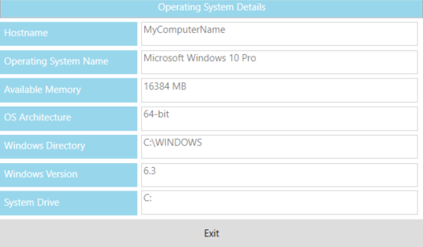
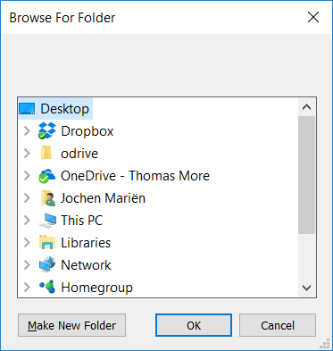
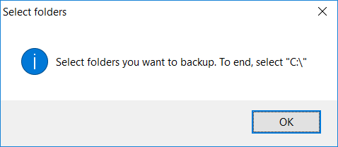
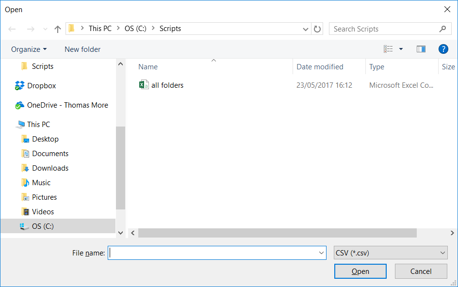

# User interfaces
## Computer information
A man called David das Neves once spoke at a PowerShell conference in Asia. He spoke of XAML forms, and gave an example of a form showing some computer information. That form was the following.

```PowerShell
#requires -Version 1
<#
.NOTES
============================================================================
Date:       20.04.2016
Presenter:  David das Neves
Version:    1.0
Project:    PSConfAsia - GUI
Ref:        http://blogs.technet.com/b/platformspfe/archive/2014/01/20/introduction-to-xaml.aspx
============================================================================

.DESCRIPTION
Presentation data
#>

#==============================================================================================
# XAML Code - Imported from Visual Studio Community WPF Application
#==============================================================================================

[void][System.Reflection.Assembly]::LoadWithPartialName('presentationframework')
[xml]$XAML = @'
<Window
xmlns="http://schemas.microsoft.com/winfx/2006/xaml/presentation"
xmlns:x="http://schemas.microsoft.com/winfx/2006/xaml"
Title="OS Details" Height="306" Width="525" WindowStartupLocation="CenterScreen" WindowStyle='None' ResizeMode='NoResize'>
<Grid Margin="0,0,-0.2,0.2">
<TextBox HorizontalAlignment="Center" Height="23" TextWrapping="Wrap" Text="Operating System Details" VerticalAlignment="Top" Width="525" Margin="0,-1,-0.2,0" TextAlignment="Center" Foreground="White" Background="#FF98D6EB"/>
<Label Content="Hostname" HorizontalAlignment="Left" Margin="0,27,0,0" VerticalAlignment="Top" Height="30" Width="170" Background="#FF98D6EB" Foreground="White"/>
<Label Content="Operating System Name" HorizontalAlignment="Left" Margin="0,62,0,0" VerticalAlignment="Top" Height="30" Width="170" Background="#FF98D6EB" Foreground="White"/>
<Label Content="Available Memory" HorizontalAlignment="Left" Margin="0,97,0,0" VerticalAlignment="Top" Height="30" Width="170" Background="#FF98D6EB" Foreground="White"/>
<Label Content="OS Architecture" HorizontalAlignment="Left" Margin="0,132,0,0" VerticalAlignment="Top" Height="30" Width="170" Background="#FF98D6EB" Foreground="White"/>
<Label Content="Windows Directory" HorizontalAlignment="Left" Margin="0,167,0,0" VerticalAlignment="Top" Height="30" Width="170" Background="#FF98D6EB" Foreground="White"/>
<Label Content="Windows Version" HorizontalAlignment="Left" Margin="0,202,0,0" VerticalAlignment="Top" Height="30" Width="170" Background="#FF98D6EB" Foreground="White"/>
<Label Content="System Drive" HorizontalAlignment="Left" Margin="0,237,0,0" VerticalAlignment="Top" Height="30" Width="170" Background="#FF98D6EB" Foreground="White"/>
<Button Name="btnExit" Content="Exit" HorizontalAlignment="Left" Margin="0,272,0,0" VerticalAlignment="Top" Width="525" Height="34" BorderThickness="0"/>
<TextBox Name="txtHostName" HorizontalAlignment="Left" Height="30" Margin="175,27,0,0" TextWrapping="Wrap" Text="" VerticalAlignment="Top" Width="343" IsEnabled="False"/>
<TextBox Name="txtOSName" HorizontalAlignment="Left" Height="30" Margin="175,62,0,0" TextWrapping="Wrap" Text="" VerticalAlignment="Top" Width="343" IsEnabled="False"/>
<TextBox Name="txtAvailableMemory" HorizontalAlignment="Left" Height="30" Margin="175,97,0,0" TextWrapping="Wrap" Text="" VerticalAlignment="Top" Width="343" IsEnabled="False"/>
<TextBox Name="txtOSArchitecture" HorizontalAlignment="Left" Height="30" Margin="175,132,0,0" TextWrapping="Wrap" Text="" VerticalAlignment="Top" Width="343" IsEnabled="False"/>
<TextBox Name="txtWindowsDirectory" HorizontalAlignment="Left" Height="30" Margin="175,167,0,0" TextWrapping="Wrap" Text="" VerticalAlignment="Top" Width="343" IsEnabled="False"/>
<TextBox Name="txtWindowsVersion" HorizontalAlignment="Left" Height="30" Margin="175,202,0,0" TextWrapping="Wrap" Text="" VerticalAlignment="Top" Width="343" IsEnabled="False"/>
<TextBox Name="txtSystemDrive" HorizontalAlignment="Left" Height="30" Margin="175,236,0,0" TextWrapping="Wrap" Text="" VerticalAlignment="Top" Width="343" IsEnabled="False"/>
</Grid>
</Window>

'@
#Read XAML
$reader = (New-Object -TypeName System.Xml.XmlNodeReader -ArgumentList $XAML)
try
{
    $Form = [Windows.Markup.XamlReader]::Load( $reader )
}
catch
{
    Write-Host -Object 'Unable to load Windows.Markup.XamlReader. Some possible causes for this problem include: .NET Framework is missing PowerShell must be launched with PowerShell -sta, invalid XAML code was encountered.'

    exit
}

#===========================================================================
# Store Form Objects In PowerShell
#===========================================================================

$XAML.SelectNodes('//*[@Name]') | ForEach-Object -Process {
    Set-Variable -Name ($_.Name) -Value $Form.FindName($_.Name)
}

#===========================================================================
# Add events to Form Objects
#===========================================================================

#===========================================================================
# Stores WMI values in WMI Object from Win32_Operating System Class
#===========================================================================

#===========================================================================
# Links WMI Object Values to XAML Form Fields
#===========================================================================

#===========================================================================
# Shows the form
#===========================================================================

$null = $Form.ShowDialog()
```

When you run this form you'll notice that it doesn't do anything. That is because the code that did things was removed.

If you look up David's original script, you'll find he used Get-WmiObject on the Win32_Operatingsystem class, but since then, the Get-ComputerInfo cmdlet has become available.

Add the code to the form to get to the following point:



Also make sure the "Exit"-button actually works.


[Solution](Solutions/Computer_information_1.ps1)
## The backupscript – A gui

Remember the backupscript you wrote in "The backupscript – the script" on page 22, and that you updated in "The backupscript – Parameters and help" on page 31? We'll add a very simple GUI for that now!

The whole idea is not to alter the existing script, but to write a second script that calls the first script.

When the second script is run, it displays a "Select folder" dialog to select the destinationfolder…



If you select "C:\", the script assumes you want to create a CSV-file and displays the following dialog:



Then the folder-browser keeps on popping up until the user selects C:\. Then the script stops, after creating the correct CSV-file. It goes without saying that "C:\" shouldn't be in the CSV-file.

If the users don't select C:\ as the original destination, the following dialog is displayed:



It allows the user to select the CSV-file to use. Then, we still have to choose whether or not to create a logfile…


Clicking yes or no will run the script with or without the "-CreateLOG" switch.


[Solution](Solutions/The_backupscript_–_A_gui_1.ps1)
