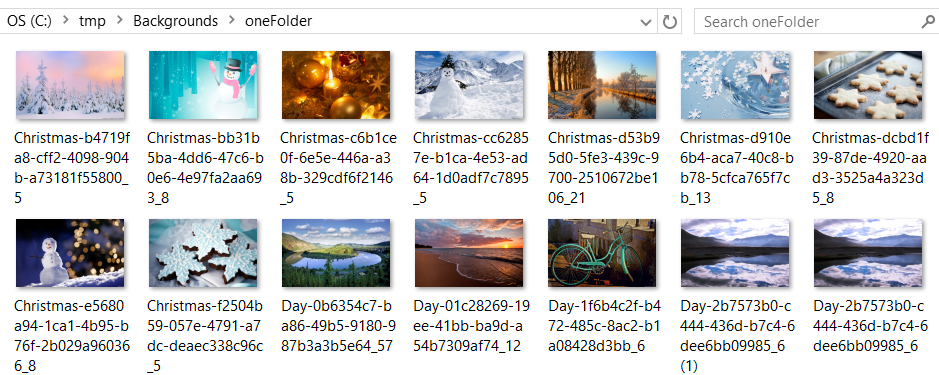
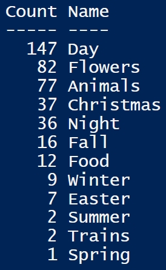
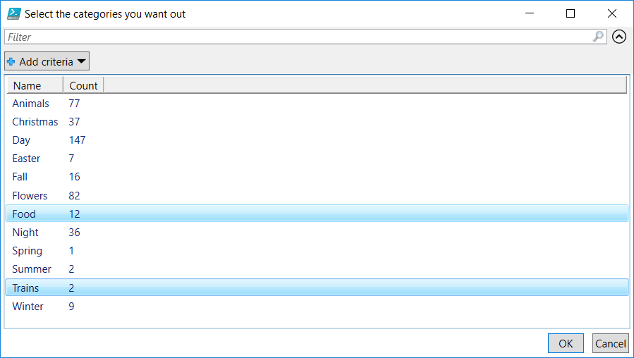

Advanced topics
====
# July first

When is the next July first? Make a cmdlet-pipe that always works, and that will show the next July first even if you execute it on the July second. You can let yourself be inspired by the following list:
* Get this year and next year as number
* Calculate the time until July first of those years
* Throw out any that are smaller than zero (that have passed)
* Show only the first item in the list

[Solution](Solutions/July_first_1.ps1)

# Remove to recycle bin

When you Remove-Item an item, it gets removed, and not moved to the recycle bin. You can move something to the recycle bin, but then you have to delete it, with the shell-object.

[Solution](Solutions/Remove_to_recycle_bin_1.ps1)

# Getting network interface information

Write a script that will export for every network adapter in your computer the MAC-address, and the corresponding IP-address. Notice that there may be multiple IP-addresses for every interface. This isn't necessarily limited to two addresses.

You can get MAC-addresses with the Get-NetAdapter cmdlet. IP-addresses can be found with Get-NetIPAddress. The link between both is the interface index. Try to copy all properties for a netadapter and all properties for all ip-addresses to the list. You'll need a prefix for the IP-addresses.

[Solution](Solutions/Getting_network_interface_information_1.ps1)

# Recursive function

A recursive function is a function that, under certain conditions, calls itself. A nice example of this is the function that gets the last write time of a folder.

The last write time of a folder is the last time something is written to a folder. This only means the folder itself, not files in the folder. We need a function that will give the last time something was written to:
* the folder itself, or
* a file in the folder, or
* a folder in the folder, or
* a file in the folder in the folder, or
* …

So we will be writing a function called "Get-LastWriteTime". The function takes a folder as argument and does the following:
* Get the last write time of the folder itself
* Get all items in the folder, and for every one of these items
	* If it's a file, and the last write time is more recent than the last write time of the folder itself, store it
	* If it's a folder, get the last write time (using the same function)

The result will be the last last write time of anything (file or folder) in the folder.

[Solution](Solutions/Recursive_function_1.ps1)

# Speech synthesis

PowerShell has a speech-assembly. An assembly is small piece of code that is contained in a dll or exe-file. The difference between an assembly and a module is that a module is always 'installed' by copying it to the PowerShell-folder, where an assembly needs to be installed with a special utility. PSSnapins are a form of assemblies.

To perform speech synthesis, aka having the computer say something, we need the "System.speech" assembly. Import it by using the "Add-Type" cmdlet.

Once imported, create a new generic "System.Speech.Synthesis.SpeechSynthesizer"-object. Use this to set the speaking rate (from -10 to +10, 0 being a normal talking speed) and the voice ("female" or "male").

Then use the "Speak" method to say stuff.

Have the computer say how long he has been running.

[Solution](Solutions/Speech_synthesis_1.ps1)

# Windows Background-images

We have a folder with a number of subfolders. In every subfolder, there are images. The name of the subfolder describes the content.

## Reformat

In Windows, it's possible to select a folder from which the Windows background is chosen. You can't choose multiple folders, so we want to move all images. To retain the information in the folder-name, we are going to rename all images to "foldername-imagename" when we move the image.

[Solution](Solutions/Windows_Background_images_1.ps1)

## Counting

After the move, we feel we are getting a lot cute animals, and not a lot of snowy images. List all categories (ex-foldernames), and count how many images of that kind we have.

[Solution](Solutions/Windows_Background_images_2.ps1)

## Seasonal

It's annoying to have pictures of eggs when you want a Christmas tree. And when you are presenting something, a halfdressed seductive looking woman is not a professional backgroup. (Unfortunately those have been censored.)

Show all categories in a gridview, and allow the user to select one or more categories. Move all these images back to a folder.

[Solution](Solutions/Windows_Background_images_3.ps1)

## Setting the background

Although we've been working with backgrounds, we haven't actually set a background. Select a random image, and set it as background.

[Solution](Solutions/Windows_Background_images_4.ps1)

## Showing images

PowerShell is good for programming to. Pick a random file, and show it in a form. An anonymous internet user called "Zippy" posted some tips on Github: https://gist.github.com/zippy1981/969855

[Solution](Solutions/Windows_Background_images_5.ps1)

## Resolution

The images in our folder vary in size. Put them in subfolders based on their size, so we can choose the correct folder for the resolution of our screen.

Also display how many there are per folder…

[Solution](Solutions/Windows_Background_images_6.ps1)

